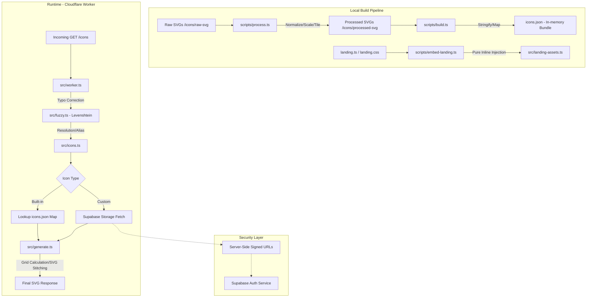

```text
                _                              
   _____ ___   / | / / ____ _   __ ____ _
  / ___// _ \ /  |/ // __ \ | / // __ `/ 
 / /   /  __// /|  // /_/ / |/ // /_/ /  
/_/    \___//_/ |_/ \____/|___/ \__,_/   
```

# Ren0va

Lightning-fast, exhaustive skill icons for your GitHub profile and READMEs.

Ren0va provides a high-performance HTTP API to generate stitched SVG grids of developer tool icons. It serves as a performant and flexible alternative to existing skill-sharing tools, offering an exhaustive icon set and the ability to serve custom user-uploaded SVGs at scale.

---

## Section 1: Documentation

### How to Use

Ren0va is designed for zero-friction integration. You can embed icons directly into your markdown files using an `` tag or a standard markdown image link.

#### 1. Direct URL Usage
Construct a URL with the icons you need, separated by commas.

```markdown

```

For professional centering in your GitHub profile, use the HTML snippet:

```html
<p align="center">
  
</p>
```

#### 2. The Landing Page
Visit [ren0va.amaanworks.me](https://ren0va.amaanworks.me) to browse the full library.
- Use the interactive selector to pick your skills.
- Customize the theme (Light/Dark) and the layout (Icons per line).
- Copy the generated `` tag and paste it directly into your GitHub README for instant integration.

### Available Icons
Ren0va ships with an exhaustive set of default icons. Below is a categorized sample of available identifiers (case-insensitive):

| Category | Icons |
| :--- | :--- |
| **Frontend** | `react`, `nextjs`, `astro`, `typescript`, `vue`, `angular`, `tailwind`, `bootstrap` |
| **Backend/DB** | `nodejs`, `go`, `python`, `rust`, `postgres`, `supabase`, `mongodb`, `redis` |
| **DevOps/Tools** | `docker`, `kubernetes`, `aws`, `cloudflare`, `github`, `git`, `ansible`, `linux` |
| **Design/Others** | `figma`, `photoshop`, `blender`, `aftereffects`, `arduino`, `raspberrypi` |

*For the full exhaustive list, search via the landing page.*

### Custom Icons
If an icon is missing or you need a personal branding element, Ren0va supports custom SVG hosting:

1.  **Upload:** Go to the landing page and navigate to the "Contribute/Custom" section.
2.  **Normalize:** Upload your SVG. The browser-side engine will normalize the scale, center the logo, and wrap it in a standardized Ren0va tile.
3.  **Preview:** View how your icon looks in both light and dark themes.
4.  **Deploy:** Once uploaded, you receive a unique ID (e.g., `custom:{uuid}/{name}`).
5.  **Use:** Include this ID in your comma-separated list: `?i=react,custom:my-id`.

---

## Section 2: Architecture & Technical Brief

### System Architecture

Ren0va is designed for maximum throughput and minimal runtime latency. The architecture is split between a heavy build pipeline and a zero-dependency edge runtime.



### Technical Highlights

-   **Server-Side Secret Management:** Unlike typical client-side implementations, Ren0va handles all communication with Supabase on the server side (Cloudflare Worker). Secure credentials and signed-url logic never touch the client browser, preventing token exposure and ensuring that custom icon fetching is strictly controlled.
-   **Fuzzy Matching (Levenshtein Distance):** The `src/fuzzy.ts` module implements the Levenshtein distance algorithm to handle typos. If a user requests `typscript`, the system resolves it to `typescript` in O(n) time against the icon map, preventing broken image renders.
-   **Atomic Build System:** The project uses a multi-stage build process. `process.ts` standardizes raw SVGs into 48x48 tiles with consistent padding and corner radii, while `build.ts` compiles these into a single `icons.json` to eliminate filesystem I/O at runtime.
-   **Pure Inline Performance:** To achieve near-zero Cumulative Layout Shift (CLS) and instant interaction on the landing page, `scripts/embed-landing.ts` injects critical assets directly into the build. The frontend uses explicitly vanilla CSS and inline JS—no heavy frameworks or hydration cycles.
-   **Theme Fallback Engine:** The `resolveIcon` logic handles dark/light variant resolution with intelligent fallbacks, ensuring that if a specific theme variant is missing, a legible alternative is served without error.

### Performance & Benchmarks

Below are the real-world performance numbers gathered from the production environment using the built-in `Server-Timing` headers and k6 load testing.

#### Internal Execution (Server-Timing)

| Request Type | Internal Logic (`resolve`) | Grid Generation (`generate`) | Total Worker Runtime |
| :--- | :--- | :--- | :--- |
| **Default Icons** | < 0.01ms | < 0.01ms | **0.00ms*** |
| **Custom Icons** | ~650ms (S3 Fetch) | < 0.01ms | ~650ms |

*\*Note: 0.00ms indicates the logic is executed entirely in-memory at the edge, finishing faster than the system's high-resolution timer can increment.*

#### Scalability & Throughput (k6 Load Test)

high-concurrency load test was performed using `k6` against the production edge endpoint:

| Metric | Result |
| :--- | :--- |
| **Success Rate** | 100% (Zero Failures) |
| **Total Requests** | 1,395 (over 30 seconds) |
| **Average Latency** | 113ms |
| **P95 Latency** | 124ms |
| **Throughput** | ~46.2 reqs/sec (10 Concurrent VUs) |


### Tech Stack
-   **Compute:** Cloudflare Workers (V8 Edge Runtime)
-   **Logic:** TypeScript (Strict Mode)
-   **UI:** Astro (Zero-JS by default) + Vanilla CSS
-   **Storage:** Supabase (S3-compatible Object Storage for custom assets)
-   **Tooling:** Wrangler, TSX, Levenshtein-algo

### Project Scripts


| Script | Command | Description |
| :--- | :--- | :--- |
| `dev` | `npm run dev` | Starts the Wrangler local development server for the Worker. |
| `process` | `npm run process` | Normalizes and tiles all SVGs in `icons/raw-svg/` into `icons/processed-svg/`. |
| `build:icons`| `npm run build:icons` | Scans processed SVGs and generates the `icons.json` manifest. |
| `build:astro`| `npm run build:astro` | Compiles the Astro landing page. |
| `build:embed`| `npm run build:embed` | Injects landing page assets into the source for inline delivery. |
| `build` | `npm run build` | Orchestrates the entire pipeline (Icons → Astro → Embed). |
| `deploy` | `npm run deploy` | Full build followed by deployment to Cloudflare production. |

### Local Setup

1.  **Clone the repository:**
    ```bash
    git clone https://github.com/dexisback/ren0va.git
    cd ren0va
    ```

2.  **Install dependencies:**
    ```bash
    npm install
    ```

3.  **Local Development:**
    ```bash
    npm run dev
    ```

4.  **Deployment:**
    *(Requires Cloudflare Authentication)*
    ```bash
    npm run deploy
    ```

### Acknowledgments
A huge thanks to the creators of the open-source fonts used in this project:
-   **Soria:** A beautiful, modern serif font.
-   **Skyscrapers:** Used for high-impact typography.
Both are stored in `public/fonts/` and serve as the visual backbone of the Ren0va brand.

Special thanks to [**skillicons.dev**](https://skillicons.dev). Many of the default icons in this library were sourced from their repository under fair use, providing the foundational set for our exhaustive library.

---

Built with ❣️ by [**@dextertwts/amaan**](https://github.com/dexisback).
