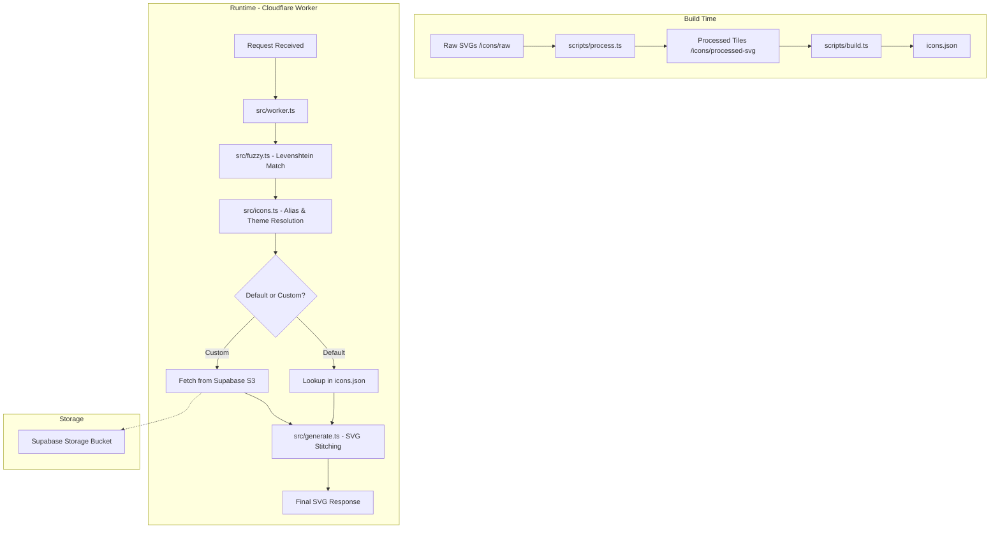

# Ren0va

Lightning-fast, exhaustive skill icons for your GitHub profile and READMEs.

Ren0va provides a high-performance HTTP API to generate stitched SVG grids of developer tool icons. It serves as a superior alternative to existing solutions like [skillicons.dev](https://skillicons.dev), offering a more exhaustive, frequently updated icon set and the ability to serve custom user-uploaded SVGs at scale.

---

## Section 1: Documentation

### How to Use

Ren0va is designed for zero-friction integration. You can embed icons directly into your markdown files using an `` tag or a standard markdown image link.

#### 1. Direct URL Usage
Construct a URL with the icons you need, separated by commas.

```markdown

```

#### 2. The Landing Page
Visit [ren0va.amaanworks.me](https://ren0va.amaanworks.me) to browse the full library.
- Use the interactive selector to pick your skills.
- Customize the theme (Light/Dark) and the layout (Icons per line).
- Copy the generated string or markdown snippet and paste it directly into your GitHub README.

### Available Icons
Ren0va ships with an exhaustive set of default icons. Below is a categorized sample of available identifiers (case-insensitive):

| Category | Icons |
| :--- | :--- |
| **Frontend** | `react`, `nextjs`, `astro`, `typescript`, `vue`, `angular`, `tailwind`, `bootstrap` |
| **Backend/DB** | `nodejs`, `go`, `python`, `rust`, `postgres`, `supabase`, `mongodb`, `redis` |
| **DevOps/Tools** | `docker`, `kubernetes`, `aws`, `cloudflare`, `github`, `git`, `ansible`, `linux` |
| **Design/Others** | `figma`, `photoshop`, `blender`, `aftereffects`, `arduino`, `raspberrypi` |

*For the full exhaustive list, search via the landing page.*

### Custom Icons
If an icon is missing or you need a personal branding element, Ren0va supports custom SVG hosting:

1.  **Upload:** Go to the landing page and navigate to the "Contribute/Custom" section.
2.  **Normalize:** Upload your SVG. The browser-side engine will normalize the scale, center the logo, and wrap it in a standardized Ren0va tile.
3.  **Preview:** View how your icon looks in both light and dark themes.
4.  **Deploy:** Once uploaded, you receive a unique ID (e.g., `custom:{uuid}/{name}`).
5.  **Use:** Include this ID in your comma-separated list: `?i=react,custom:my-id`.

---

## Section 2: Architecture & Technical Brief

### System Architecture

Ren0va is built for speed and efficiency, shifting expensive operations to build time and utilizing edge compute for runtime rendering.



### Technical Highlights
-   **Fuzzy Search:** Uses the Levenshtein distance algorithm in `src/fuzzy.ts` to correct typos in URL parameters (e.g., `typscript` → `typescript`) without breaking the image render.
-   **Performance-First Build:** `icons.json` is generated at build time, containing all default SVG strings. This allows the Worker to perform O(1) lookups in memory, avoiding filesystem or database hits for default icons.
-   **Edge Compute:** Hosted on Cloudflare Workers. Cold starts are non-existent, and the logic runs at the edge nearest to the user.
-   **Lightweight Frontend:** The landing page is built with Astro. It uses zero-dependency vanilla JS and CSS, ensuring a near-instant Load Time and high Lighthouse scores. No heavy React islands are used in the final build.
-   **Theming:** Every icon is processed into dark (#1e1e2e) and light (#ffffff) variants. The API intelligently falls back and resolves themes based on the `theme` parameter.

### Tech Stack
-   **Runtime:** Cloudflare Workers (Edge Runtime)
-   **Language:** TypeScript
-   **Framework:** Astro (Static Site Generation)
-   **Storage:** Supabase (S3-compatible bucket for custom icons)
-   **Deployment:** Wrangler CLI

### Local Setup

1.  **Clone the repository:**
    ```bash
    git clone https://github.com/dexisback/ren0va.git
    cd ren0va
    ```

2.  **Install dependencies:**
    ```bash
    npm install
    ```

3.  **Process new icons:**
    If you add new SVGs to `icons/raw-svg/`, run:
    ```bash
    npm run process
    npm run build
    ```

4.  **Local development:**
    ```bash
    npm run dev
    ```

5.  **Deployment:**
    ```bash
    npm run deploy
    ```

### Acknowledgments
A huge thanks to the creators of the open-source fonts used in this project:
-   **Soria:** A beautiful, modern serif font.
-   **Skyscrapers:** Used for high-impact typography.
Both are stored in `public/fonts/` and serve as the visual backbone of the Ren0va brand.

---

Built with precision by [Amaan](https://github.com/dexisback).
